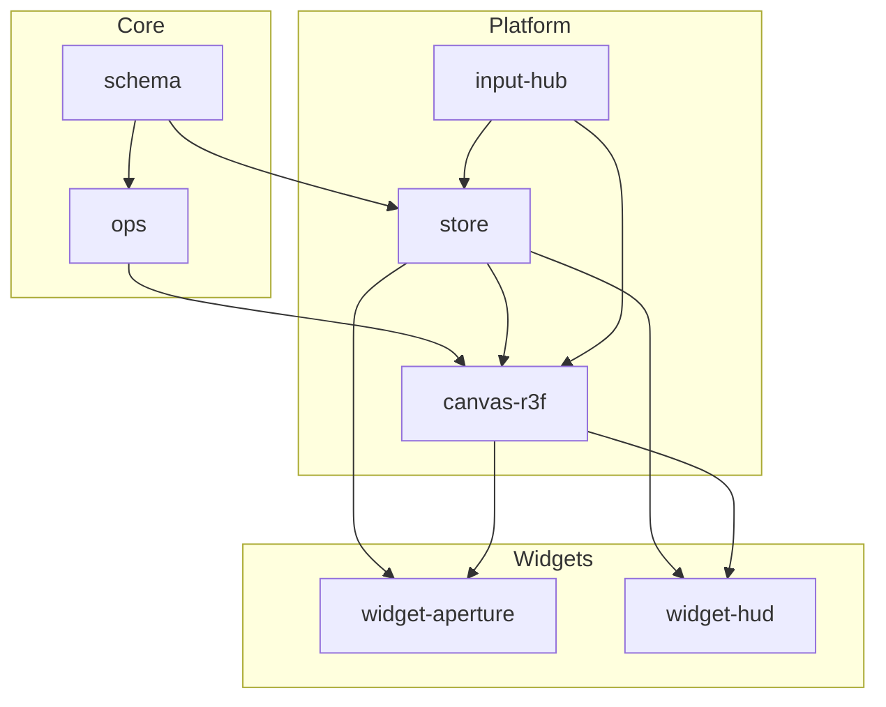

# Refinery SDK Architecture Overview

> Draft date: 2025-07-02  
> Author: Hallucination Refinery Corporation

---

## 1. Purpose
This document captures the canonical **six-layer model** that will guide the extraction of proven code from `refinery-mono` into the new public **Refinery SDK**.  
The goals are to:
1. Re-use the most stable packages from the existing monorepo without breaking changes.
2. Decouple tightly-bound concerns identified in previous audits.
3. Provide a future-proof foundation for the upcoming **Refinery Playground** service [[hallucination-refinery-vision.md]].

---

## 2. Layered Model at a Glance

| # | Layer | Package(s) (npm scope `@refinery/…`) | Responsibility | Key Architectural Decisions | Primary Artefact References |
|---|-------|---------------------------------------|----------------|-----------------------------|-----------------------------|
| 1 | **Schema** | `schema` (ex `ideanode`) | Pure domain types & graph helpers. No runtime deps beyond `three` vector math. | Re-use unchanged; publish as `@refinery/schema` v1.0.0. | • cryptic-vault-consolidated-review.md – *Component Dependency Analysis* • refinery-mono-full-spectrum-audit.md – *Workspace Packages* |
| 2 | **Ops** | `ops` (ex `thinkable`) | Algorithms: BFS, Interwingle, clustering. Depends only on Schema. | Retain existing API; ensure 100 % test pass. | • refinery-mono-full-spectrum-audit.md – *Test Coverage* |
| 3 | **Store** | `store` (ex `interaction-lite`) | Global application state via **Zustand** slices & Command Queue; eliminates global `forceGraphRef` coupling. | Implements Architectural Recommendation #1 (command pattern). | • cryptic-vault-consolidated-review.md – *Architectural Recommendations for SDK Design* |
| 4 | **Canvas** | `canvas-r3f` | Headless **Canvas Facade** that receives commands, wraps **r3f-forcegraph**, and exposes subscription API. | Hides internal refs so renderer tech can be swapped (GPU, AR). | • unorganized-concerns-ideas.md – *When to migrate* • jam-session-consolidated-review.md – *ForceGraph3D Library Lock-in* |
| 5 | **Input** | `sensors-gesture`, `sensors-voice`, `input-hub` | Normalise multimodal inputs (gesture, voice, mouse) and publish semantic **Intent Events** on a typed bus. | Replaces window-scoped events with scoped event bus & hooks. | • jam-session-consolidated-review.md – *Event-Driven Input Pipeline* • unorganized-concerns-ideas.md – *Hand Tracking Improvement Idea* |
| 6 | **Widgets** | `widget-aperture`, `widget-hud`, … | Optional UI widgets (e.g., Idea Aperture pad) & HUD overlays. | Packaged independently; rely only on Store & Canvas. | • demo-collaborations.md – *Idea Aperture* |

---

## 3. Inter-Layer Relationships

---

## 4. Cross-Cutting Concerns

### 4.1 Versioning & Publishing
* **Independent SemVer per package**; managed via **changesets** workflow.  
* CI publishes pre-release tags (`next`) on every merge to `main`, stable on GitHub Releases.

### 4.2 Testing & Quality Gates
* **Vitest** + React Testing Library for units/integration.  
* Coverage thresholds: ≥ 80 % for Layers 1–3, ≥ 60 % for Layers 4–6 [[refinery-mono-full-spectrum-audit.md]].
* Chromatic visual regression for Plug-in packs.

### 4.3 Performance Targets
* Renderer must sustain **≥ 60 FPS @ ≤ 1 000 nodes** on M-series Mac; physics auto-freezes after `cooldownTicks` [[unorganized-concerns-ideas.md – Quick-win optimisations]].

### 4.4 Accessibility & Internationalisation
* All UI plug-ins follow **WCAG 2.2 AA** guidelines.  
* Text & ARIA labels externalised for i18n.

### 4.5 Extensibility
* Typed **Event Bus** (`createTypedEventBus<TEvents>()`) exported from Layer 5 for external modality packs.  
* Renderer swappable via `RendererFacade` interface (`render(cmd: RenderCommand)` → `Promise<void>`).

---

## 5. Implementation Roadmap (Summary)
1. **Week 1–2:** Extract Layers 1–2; ensure passing CI.  
2. **Week 2–3:** Build `interaction-lite`, migrate state & commands.  
3. **Week 3–4:** Introduce `RendererFacade`, decouple ref.  
4. **Week 4–5:** Solidify Input Hub & first Plug-in Pack.  
5. **Week 6:** Release v1.0 candidates; freeze public API.

(See detailed Week-by-Week Roadmap in project plan.)

---

## 6. Glossary
* **Intent Event** – High-level semantic action emitted from input layer (e.g., `selectNode`, `zoomTo`).
* **Renderer Facade** – Interface boundary hiding underlying 3-D tech from state & plugins.
* **Command Queue** – FIFO log of RendererCommands produced by state slices and replayed by renderer.

---

## 7. Change Log
| Date | Author | Description |
|------|--------|-------------|
| 2025-07-02 | WB | Initial draft capturing six-layer architecture with artefact citations. |

## 8. Implementation Status (2025-07-03)

- **Schema & Ops** – Imported from `refinery-mono`; green build and full test pass (126 tests).
- **Store** – Zustand slice scaffold committed; compiles clean, tests to be written.
- **Canvas / Renderer Facade** – Skeleton only; no rendering logic yet.
- **Input Hub** – Project structure scaffolding only.
- **Widgets** – Package skeletons present; build currently disabled pending TypeScript fixes.
