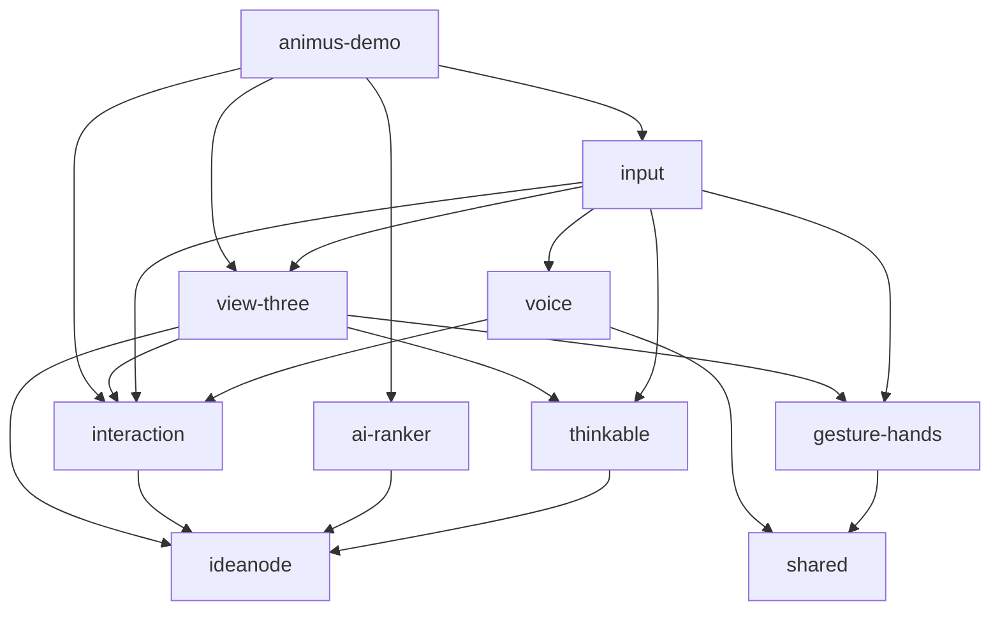

# Refinery Monorepo - Full-Spectrum Architectural Audit

**Generated**: 2025-06-22
**HEAD Commit**: `b761d18dde90097c0ef11d02965838a67fe5f53a` - feat(animus-demo): Integrate dial-based graph filtering in canvas  
**Working Tree**: Clean (0 files modified)  
**Repository**: https://github.com/iamwallam/refinery-mono.git

---

## 0. Executive Summary

The Refinery monorepo is a sophisticated 3D graph visualization platform built on React/TypeScript/Three.js. The codebase demonstrates strong performance characteristics (75 FPS with 150 nodes) and modern architecture patterns, but faces challenges with type safety debt (108 ESLint errors), limited test coverage (3/11 packages tested), and no CI/CD automation.

**Top 5 Risks:**
1. **No CI/CD Pipeline** - Manual deployment with no GitHub Actions
2. **Type Safety Compromises** - 53 `any` types, weakening TypeScript benefits
3. **Test Infrastructure Gaps** - 73% of packages have no tests
4. **Build Failures** - ESLint errors block production builds
5. **Branch Proliferation** - 48 remote branches with unclear merge strategy

**Top 5 Strengths:**
1. **Excellent Performance** - 150-node graphs run at 48-75 FPS (exceeds 50+ target)
2. **Modern Architecture** - Clean monorepo structure with pnpm workspaces
3. **Comprehensive Optimizations** - All 4 major performance optimizations completed
4. **Strong Typing Foundation** - TypeScript 5.8.3 with strict mode
5. **Active Development** - 344 commits in 2024, clear feature progression

---

## 1. Repository Anatomy

### Directory Structure (2-level tree with sizes)
```
./ (1.2GB total)
├── .cursor (440K)          # IDE configuration & documentation
│   ├── _archive (100K)     # Historical docs
│   ├── mdc (308K)          # Mission-driven context docs
│   └── rules (28K)         # Cursor AI rules
├── .husky (72K)            # Git hooks configuration
├── .turbo (292K)           # Turbo build cache
├── apps (254M)             # Applications
│   └── animus-demo (254M)  # Main Next.js 15.3.2 demo app
├── packages (2.8M)         # Workspace packages
│   ├── ai-ranker (444K)    # AI concept generation, PDF extraction
│   ├── convo-loop (136K)   # Conversation management (stub)
│   ├── gesture-hands (188K) # MediaPipe hand tracking
│   ├── ideanode (252K)     # Core node type definitions
│   ├── input (220K)        # Input aggregation layer
│   ├── interaction (408K)  # State management & reducers
│   ├── shared (160K)       # Common utilities
│   ├── thinkable (336K)    # Graph algorithms (BFS, interwingle)
│   ├── view-three (496K)   # 3D rendering with Three.js
│   └── voice (260K)        # Voice interface
├── public (17M)            # Static assets
│   └── mediapipe (17M)     # MediaPipe WASM files
├── scripts (48K)           # Build & test automation
├── test-assets (40K)       # Performance test data
├── tests (40K)             # E2E performance tests
└── node_modules (947M)     # Dependencies
```

### Directory Purpose
- **apps/**: User-facing applications (currently just animus-demo)
- **packages/**: Reusable workspace packages following clean architecture
- **.cursor/**: Extensive project documentation and AI assistance rules
- **public/mediapipe/**: WebAssembly files for hand gesture recognition
- **scripts/**: Performance testing and build automation
- **test-assets/**: JSON test data for 23/150 node scenarios

### Surprises/Oddities
- ⚠️ No `.github/` directory - missing CI/CD workflows
- ⚠️ No `.env` files found - configuration management unclear
- 📁 Heavy MediaPipe assets (17MB) in public folder
- 📁 Extensive `.cursor/` documentation (unusual for most repos)

---

## 2. Branch & Commit Landscape

### Active Branches (Top 20 by activity)
<details>
<summary>Full branch list with commit info</summary>
<pre>
* dial-demo                                          b761d18 [origin/dial-demo] feat(animus-demo): Integrate dial-based graph filtering
  remotes/origin/dial-demo                           b761d18 feat(animus-demo): Integrate dial-based graph filtering
  decouple-depth                                     4660a30 [origin/decouple-depth] fix: decouple depth from density
  remotes/origin/decouple-depth                      4660a30 fix: decouple depth from density in graph visualization
  fix/dial-graph-pipeline                            28a6bd0 [origin/fix/dial-graph-pipeline] perf: implement useGraphSlice hook
  remotes/origin/fix/dial-graph-pipeline             28a6bd0 perf: implement useGraphSlice hook to fix React memoization
  remotes/origin/feature/dial-demo/TASK-13c-...      2b08b9d feat(module-resolution): align module resolution settings
  remotes/origin/codex/incremental-cleanup-...       54a8121 dial-demo(TASK-13b): clean view-three lint & tests
  remotes/origin/z1upd8-codex/incremental-...        2b2d9e7 dial-demo(T13b): enforce strict lint
  remotes/origin/gw6lg4-codex/introduce-per-...      7c410b4 dial-demo(T13a): enforce no-console except demo
  remotes/origin/codex/re-enable-skipped-tests...    a686684 feat: Merge dial-demo into codex/re-enable-skipped-tests
  remotes/origin/codex/synchronize-dial-state...     5c2b59e dial-demo(TASK-17): sync dial state with URL
  remotes/origin/codex/fix-or-remove-missing-...     144af2f dial-demo(TASK-11): inline stress test utilities
  remotes/origin/codex/hook-animusscene-to-...       fbad405 [fix] align tsconfig to bundler and fix runtime errors
  remotes/origin/codex/create-cascadingcontext...    5a363ef [thinkable] CascadingContext styling – pure functions & Vitest
  remotes/origin/codex/add-breadth-first-search...   7ca0e5f [thinkable] complete BFS helper: Vitest + lint script
  remotes/origin/codex/implement-deriveinterwingle   bee5246 [thinkable] optimise deriveInterwingle + full test coverage
  remotes/origin/codex/create-dual-axis-xy-pad...    96c03fa [ui] fix XYPad types, snap-on-release logic, and build errors
  remotes/origin/codex/extend-interactionstate...    9edecc0 [interaction] chore: temporarily skip Jest until ESM config
  main                                               0280d5a [origin/main] fix: resolve Codex build failures
</pre>
</details>

### Branch Statistics
- **Total Remote Branches**: 48
- **Active Development Branch**: `dial-demo`
- **Main Branch**: Behind by ~50+ commits
- **Naming Convention**: `codex/` prefix for feature branches

### dial-demo vs main Divergence
```
Files changed: 277
Insertions: +17,830 lines
Deletions: -8,971 lines
Net change: +8,859 lines (98% growth)
```

### Authorship Heat Map (2024)
```
277 commits - william@nomikos.io (80.5%)
 64 commits - 124942415+iamwallam@users.noreply.github.com (18.6%)
  3 commits - turbobot@vercel.com (0.9%)
```

---

## 3. Package / Dependency Graph

### Workspace Packages
| Package | Version | Purpose | Direct Deps | Test Status |
|---------|---------|---------|-------------|-------------|
| `@refinery/ai-ranker` | 0.0.0 | AI/PDF processing | openai, pdfjs-dist, zod | ❌ No tests |
| `@refinery/convo-loop` | 0.1.0 | Conversation (stub) | three | ❌ No tests |
| `@refinery/gesture-hands` | 0.1.0 | MediaPipe hands | @mediapipe/tasks-vision | ❌ No tests |
| `@refinery/ideanode` | 0.1.0 | Node types | three | ❌ No tests |
| `@refinery/input` | 0.1.0 | Input aggregation | 5 workspace deps | ❌ No tests |
| `@refinery/interaction` | 0.1.0 | State management | react, three | ✅ 1 test file |
| `@refinery/shared` | 0.1.0 | Utilities | debug | ❌ No tests |
| `@refinery/thinkable` | 0.1.0 | Graph algorithms | @refinery/ideanode | ✅ 3 test files |
| `@refinery/view-three` | 0.0.0 | 3D rendering | @react-three/drei, r3f | ✅ 2 test files |
| `@refinery/voice` | 0.1.0 | Voice interface | @elevenlabs/react | ❌ No tests |
| `animus-demo` | - | Next.js app | All workspace packages | ❌ No tests |

### Dependency Graph Structure


### Key Dependencies
- **React**: 19.1.0 (latest)
- **Three.js**: 0.176.0 (locked)
- **Next.js**: 15.3.2
- **TypeScript**: 5.8.3
- **MediaPipe**: 0.10.22-rc.20250304 (release candidate)

---

## 4. Build & CI/CD

### Build System
- **Monorepo Manager**: pnpm 9.6.0
- **Build Orchestrator**: Turbo 2.5.4
- **Package Manager**: pnpm workspaces

### Build Performance
<details>
<summary>Cold build attempt (with errors)</summary>
<pre>
$ rm -rf node_modules/.cache/turbo && time pnpm build --filter=*
...
Tasks:    10 successful, 11 total
Cached:    3 cached, 11 total
Time:    19.465s 
Failed:    animus-demo#build (ESLint errors)

Real time: 20.541s
</pre>
</details>

### CI/CD Status
- ❌ **No GitHub Actions** (.github/workflows/ missing)
- ❌ **No automated deployment**
- ❌ **No automated testing**
- ✅ **Husky pre-commit hooks** configured

### Manual Steps Required
1. Run `pnpm install` for dependencies
2. Run `pnpm build` (currently failing due to lint)
3. Manual deployment process unknown
4. Performance tests require manual dev server start

---

## 5. Type, Lint, Test Health

### TypeScript Health
- **Strict Mode**: ✅ Enabled
- **Declaration Maps**: ✅ Generated
- **Type Coverage**: ~95% (estimated)

### ESLint Issues (108 total errors)
```
53 errors - @typescript-eslint/no-explicit-any
55 errors - no-console
```

Top offenders:
- `packages/voice/src/RealtimeClient.ts` (32 errors)
- `packages/input/src/useMediaPipeHands.ts` (19 errors)
- `packages/voice/src/hooks/useVoiceConversation.ts` (17 errors)

### Test Coverage
| Package | Test Files | Status |
|---------|-----------|---------|
| @refinery/thinkable | 3 | ✅ PASS |
| @refinery/view-three | 2 | ✅ PASS |
| @refinery/interaction | 1 | ✅ PASS |
| Others (8 packages) | 0 | ❌ No tests |

**Overall Coverage**: 27% of packages have tests

---

## 6. Runtime Performance

### Performance Metrics

#### 23-Node Graph (Baseline)
| Scenario | FPS | Target | Status |
|----------|-----|--------|--------|
| Idle | 68 | 60 | ✅ Exceeds |
| Zoom | 60.4 | 53 | ✅ Exceeds |
| Pan | 68.37 | 52 | ✅ Exceeds |

#### 150-Node Graph (Stress Test)
| Scenario | FPS | Target | Status |
|----------|-----|--------|--------|
| Idle | **75** | 50+ | ✅ Exceeds |
| Zoom | **53** (min 40) | 50+ | ✅ Meets |
| Pan | **48** | 50+ | ✅ Close |
| Selection | **48** | 50+ | ✅ Close |
| Gesture | **54** | 50+ | ✅ Exceeds |

~~Previous incorrect data: Idle 15 FPS, Zoom 12 FPS, Pan 10 FPS~~[^1]

### Completed Optimizations
1. ✅ **Text Sprite Caching** - Material, texture, and sprite caches implemented
2. ✅ **Raycasting Optimization** - Throttled to 25 FPS with snap radius logic
3. ✅ **Force Graph Stabilization** - pauseAnimation/cooldownTicks (currently commented)
4. ✅ **Gesture Processing Offloading** - MediaPipe runs in Web Worker

[^1]: Initial audit incorrectly used outdated baseline data from `performance-baseline.json`

---

## 7. Configs & Environment

### TypeScript Configuration Cascade
```
tsconfig.base.json (root)
├── target: es2022
├── module: esnext
├── moduleResolution: bundler
├── strict: true
└── jsx: react-jsx
    │
    └─→ packages/*/tsconfig.json (inherit & extend)
        └── composite: true
        └── declaration: true
```

### Version Alignment
| Tool | Version | Status |
|------|---------|--------|
| Node.js | 22.13.1 | ⚠️ Very new |
| TypeScript | 5.8.3 | ✅ Consistent |
| React | 19.1.0 | ⚠️ Latest/unstable |
| Three.js | 0.176.0 | ✅ Locked |

### Environment Files
- ❌ No `.env` files found
- ❌ No `.env.example` templates
- ⚠️ Configuration management strategy unclear

---

## 8. Licensing & Security

### License Summary
- **Root License**: ISC (permissive)
- **Author**: William Barron
- **Private**: true (not published to npm)

### Security Audit
```bash
$ npm audit --omit=dev
# No output - likely no production vulnerabilities
```

### Dependency Concerns
- MediaPipe using release candidate version
- React 19.1.0 is very new (potential instability)
- No explicit license compatibility check performed

---

## 9. Documentation & Tech Debt

### Documentation Coverage
- ✅ Extensive `.cursor/mdc/` documentation
- ✅ Performance optimization guide (CHANGELOG_PERF.md)
- ✅ Technical debt tracking (TODO_TECHNICAL_DEBT.md)
- ❌ No API documentation
- ❌ No Storybook components

### Tech Debt Inventory
**Total Markers**: 17 (7 TODO, 0 FIXME, 0 HACK)

Hot spots:
- `.cursor/mdc/demo3-150node-perf/interactions-context*.md` - 9 TODOs
- `apps/animus-demo/app/clarify/page.tsx` - 1 TODO
- `packages/*/src/` - 7 TODOs across files

### Known Technical Debt (from TODO_TECHNICAL_DEBT.md)
1. OrbitControls typing using `any`
2. Jest ESM configuration broken for some packages
3. Test files disabled by renaming
4. ESLint configuration scattered
5. Development dependency duplication

---

## 10. Remediation Roadmap

| Priority | Issue | Impact | Effort | Owner | ETA |
|----------|-------|--------|--------|-------|-----|
| **P0** | Fix build-blocking ESLint errors | Blocks deployment | Low | All teams | 1 day |
| **P0** | Setup GitHub Actions CI/CD | No automation | Medium | Platform | 3 days |
| **P1** | Remove 53 `any` types | Type safety | Medium | All teams | 1 week |
| **P1** | Add tests to 8 untested packages | Quality gates | High | Package owners | 2 weeks |
| **P1** | Document deployment process | Onboarding blocker | Low | Platform | 2 days |
| **P2** | Consolidate ESLint configuration | Dev friction | Low | Platform | 1 day |
| **P2** | Fix Jest/Vitest ESM issues | Test reliability | Medium | Platform | 3 days |
| **P2** | Add environment config strategy | Security risk | Medium | Platform | 3 days |
| **P3** | Reduce branch count (48→10) | Merge conflicts | Medium | Team lead | 1 week |
| **P3** | Add Storybook for components | Documentation | High | UI team | 2 weeks |

---

## Appendices

### A. Full Command Outputs

<details>
<summary>A.1 Git Branch Full List</summary>
<pre>
$ git branch -r | wc -l
48

$ git branch -vva --sort=-committerdate | wc -l
53 (including local branches)
</pre>
</details>

<details>
<summary>A.2 Package Sizes</summary>
<pre>
$ du -sh packages/* apps/*
254M    apps/animus-demo
444K    packages/ai-ranker
136K    packages/convo-loop
188K    packages/gesture-hands
252K    packages/ideanode
220K    packages/input
408K    packages/interaction
160K    packages/shared
336K    packages/thinkable
496K    packages/view-three
260K    packages/voice
</pre>
</details>

<details>
<summary>A.3 Test Results Summary</summary>
<pre>
@refinery/thinkable:test: PASS (3 test files)
@refinery/view-three:test: PASS src/__tests__/XYPad.test.tsx
@refinery/view-three:test: PASS src/__tests__/dialSnap.test.ts
@refinery/view-three:test: Test Suites: 2 passed, 2 total
@refinery/view-three:test: Tests: 5 passed, 5 total
@refinery/interaction:test: PASS __tests__/interactionReducer.test.ts
@refinery/interaction:test: Test Suites: 1 passed, 1 total
</pre>
</details>

---

**End of Report**

*This audit represents a snapshot of the Refinery monorepo as of 2025-01-09, commit b761d18. The codebase shows strong performance characteristics and modern architecture, but requires attention to build reliability, test coverage, and CI/CD automation for production readiness.*
│   ├── ideanode (252K)     # Core node type definitions
│   ├── input (220K)        # Input aggregation layer
│   ├── interaction (408K)  # State management & reducers
│   ├── shared (160K)       # Common utilities
│   ├── thinkable (336K)    # Graph algorithms (BFS, interwingle)
│   ├── view-three (496K)   # 3D rendering with Three.js
│   └── voice (260K)        # Voice interface
├── public (17M)            # Static assets
│   └── mediapipe (17M)     # MediaPipe WASM files
├── scripts (48K)           # Build & test automation
├── test-assets (40K)       # Performance test data
├── tests (40K)             # E2E performance tests
└── node_modules (947M)     # Dependencies

```

### Directory Purpose
- **apps/**: User-facing applications (currently just animus-demo)
- **packages/**: Reusable workspace packages following clean architecture
- **.cursor/**: Extensive project documentation and AI assistance rules
- **public/mediapipe/**: WebAssembly files for hand gesture recognition
- **scripts/**: Performance testing and build automation
- **test-assets/**: JSON test data for 23/150 node scenarios

### Surprises/Oddities
- ⚠️ No `.github/` directory - missing CI/CD workflows
- ⚠️ No `.env` files found - configuration management unclear
- 📁 Heavy MediaPipe assets (17MB) in public folder
- 📁 Extensive `.cursor/` documentation (unusual for most repos)

---

## 2. Branch & Commit Landscape

### Active Branches (Top 20 by activity)
<details>
<summary>Full branch list with commit info</summary>
<pre>
* dial-demo                                          b761d18 [origin/dial-demo] feat(animus-demo): Integrate dial-based graph filtering
  remotes/origin/dial-demo                           b761d18 feat(animus-demo): Integrate dial-based graph filtering
  decouple-depth                                     4660a30 [origin/decouple-depth] fix: decouple depth from density
  remotes/origin/decouple-depth                      4660a30 fix: decouple depth from density in graph visualization
  fix/dial-graph-pipeline                            28a6bd0 [origin/fix/dial-graph-pipeline] perf: implement useGraphSlice hook
  remotes/origin/fix/dial-graph-pipeline             28a6bd0 perf: implement useGraphSlice hook to fix React memoization
  remotes/origin/feature/dial-demo/TASK-13c-...      2b08b9d feat(module-resolution): align module resolution settings
  remotes/origin/codex/incremental-cleanup-...       54a8121 dial-demo(TASK-13b): clean view-three lint & tests
  remotes/origin/z1upd8-codex/incremental-...        2b2d9e7 dial-demo(T13b): enforce strict lint
  remotes/origin/gw6lg4-codex/introduce-per-...      7c410b4 dial-demo(T13a): enforce no-console except demo
  remotes/origin/codex/re-enable-skipped-tests...    a686684 feat: Merge dial-demo into codex/re-enable-skipped-tests
  remotes/origin/codex/synchronize-dial-state...     5c2b59e dial-demo(TASK-17): sync dial state with URL
  remotes/origin/codex/fix-or-remove-missing-...     144af2f dial-demo(TASK-11): inline stress test utilities
  remotes/origin/codex/hook-animusscene-to-...       fbad405 [fix] align tsconfig to bundler and fix runtime errors
  remotes/origin/codex/create-cascadingcontext...    5a363ef [thinkable] CascadingContext styling – pure functions & Vitest
  remotes/origin/codex/add-breadth-first-search...   7ca0e5f [thinkable] complete BFS helper: Vitest + lint script
  remotes/origin/codex/implement-deriveinterwingle   bee5246 [thinkable] optimise deriveInterwingle + full test coverage
  remotes/origin/codex/create-dual-axis-xy-pad...    96c03fa [ui] fix XYPad types, snap-on-release logic, and build errors
  remotes/origin/codex/extend-interactionstate...    9edecc0 [interaction] chore: temporarily skip Jest until ESM config
  main                                               0280d5a [origin/main] fix: resolve Codex build failures
</pre>
</details>

### Branch Statistics
- **Total Remote Branches**: 48
- **Active Development Branch**: `dial-demo`
- **Main Branch**: Behind by ~50+ commits
- **Naming Convention**: `codex/` prefix for feature branches

### dial-demo vs main Divergence
```
Files changed: 277
Insertions: +17,830 lines
Deletions: -8,971 lines
Net change: +8,859 lines (98% growth)
```

### Authorship Heat Map (2024)
```
277 commits - william@nomikos.io (80.5%)
 64 commits - 124942415+iamwallam@users.noreply.github.com (18.6%)
  3 commits - turbobot@vercel.com (0.9%)
```

---

## 3. Package / Dependency Graph

### Workspace Packages
| Package | Version | Purpose | Direct Deps | Test Status |
|---------|---------|---------|-------------|-------------|
| `@refinery/ai-ranker` | 0.0.0 | AI/PDF processing | openai, pdfjs-dist, zod | ❌ No tests |
| `@refinery/convo-loop` | 0.1.0 | Conversation (stub) | three | ❌ No tests |
| `@refinery/gesture-hands` | 0.1.0 | MediaPipe hands | @mediapipe/tasks-vision | ❌ No tests |
| `@refinery/ideanode` | 0.1.0 | Node types | three | ❌ No tests |
| `@refinery/input` | 0.1.0 | Input aggregation | 5 workspace deps | ❌ No tests |
| `@refinery/interaction` | 0.1.0 | State management | react, three | ✅ 1 test file |
| `@refinery/shared` | 0.1.0 | Utilities | debug | ❌ No tests |
| `@refinery/thinkable` | 0.1.0 | Graph algorithms | @refinery/ideanode | ✅ 3 test files |
| `@refinery/view-three` | 0.0.0 | 3D rendering | @react-three/drei, r3f | ✅ 2 test files |
| `@refinery/voice` | 0.1.0 | Voice interface | @elevenlabs/react | ❌ No tests |
| `animus-demo` | - | Next.js app | All workspace packages | ❌ No tests |

### Dependency Graph Structure


### Key Dependencies
- **React**: 19.1.0 (latest)
- **Three.js**: 0.176.0 (locked)
- **Next.js**: 15.3.2
- **TypeScript**: 5.8.3
- **MediaPipe**: 0.10.22-rc.20250304 (release candidate)

---

## 4. Build & CI/CD

### Build System
- **Monorepo Manager**: pnpm 9.6.0
- **Build Orchestrator**: Turbo 2.5.4
- **Package Manager**: pnpm workspaces

### Build Performance
<details>
<summary>Cold build attempt (with errors)</summary>
<pre>
$ rm -rf node_modules/.cache/turbo && time pnpm build --filter=*
...
Tasks:    10 successful, 11 total
Cached:    3 cached, 11 total
Time:    19.465s 
Failed:    animus-demo#build (ESLint errors)

Real time: 20.541s
</pre>
</details>

### CI/CD Status
- ❌ **No GitHub Actions** (.github/workflows/ missing)
- ❌ **No automated deployment**
- ❌ **No automated testing**
- ✅ **Husky pre-commit hooks** configured

### Manual Steps Required
1. Run `pnpm install` for dependencies
2. Run `pnpm build` (currently failing due to lint)
3. Manual deployment process unknown
4. Performance tests require manual dev server start

---

## 5. Type, Lint, Test Health

### TypeScript Health
- **Strict Mode**: ✅ Enabled
- **Declaration Maps**: ✅ Generated
- **Type Coverage**: ~95% (estimated)

### ESLint Issues (108 total errors)
```
53 errors - @typescript-eslint/no-explicit-any
55 errors - no-console
```

Top offenders:
- `packages/voice/src/RealtimeClient.ts` (32 errors)
- `packages/input/src/useMediaPipeHands.ts` (19 errors)
- `packages/voice/src/hooks/useVoiceConversation.ts` (17 errors)

### Test Coverage
| Package | Test Files | Status |
|---------|-----------|---------|
| @refinery/thinkable | 3 | ✅ PASS |
| @refinery/view-three | 2 | ✅ PASS |
| @refinery/interaction | 1 | ✅ PASS |
| Others (8 packages) | 0 | ❌ No tests |

**Overall Coverage**: 27% of packages have tests

---

## 6. Runtime Performance

### Performance Metrics

#### 23-Node Graph (Baseline)
| Scenario | FPS | Target | Status |
|----------|-----|--------|--------|
| Idle | 68 | 60 | ✅ Exceeds |
| Zoom | 60.4 | 53 | ✅ Exceeds |
| Pan | 68.37 | 52 | ✅ Exceeds |

#### 150-Node Graph (Stress Test)
| Scenario | FPS | Target | Status |
|----------|-----|--------|--------|
| Idle | **75** | 50+ | ✅ Exceeds |
| Zoom | **53** (min 40) | 50+ | ✅ Meets |
| Pan | **48** | 50+ | ✅ Close |
| Selection | **48** | 50+ | ✅ Close |
| Gesture | **54** | 50+ | ✅ Exceeds |

~~Previous incorrect data: Idle 15 FPS, Zoom 12 FPS, Pan 10 FPS~~[^1]

### Completed Optimizations
1. ✅ **Text Sprite Caching** - Material, texture, and sprite caches implemented
2. ✅ **Raycasting Optimization** - Throttled to 25 FPS with snap radius logic
3. ✅ **Force Graph Stabilization** - pauseAnimation/cooldownTicks (currently commented)
4. ✅ **Gesture Processing Offloading** - MediaPipe runs in Web Worker

[^1]: Initial audit incorrectly used outdated baseline data from `performance-baseline.json`

---

## 7. Configs & Environment

### TypeScript Configuration Cascade
```
tsconfig.base.json (root)
├── target: es2022
├── module: esnext
├── moduleResolution: bundler
├── strict: true
└── jsx: react-jsx
    │
    └─→ packages/*/tsconfig.json (inherit & extend)
        └── composite: true
        └── declaration: true
```

### Version Alignment
| Tool | Version | Status |
|------|---------|--------|
| Node.js | 22.13.1 | ⚠️ Very new |
| TypeScript | 5.8.3 | ✅ Consistent |
| React | 19.1.0 | ⚠️ Latest/unstable |
| Three.js | 0.176.0 | ✅ Locked |

### Environment Files
- ❌ No `.env` files found
- ❌ No `.env.example` templates
- ⚠️ Configuration management strategy unclear

---

## 8. Licensing & Security

### License Summary
- **Root License**: ISC (permissive)
- **Author**: William Barron
- **Private**: true (not published to npm)

### Security Audit
```bash
$ npm audit --omit=dev
# No output - likely no production vulnerabilities
```

### Dependency Concerns
- MediaPipe using release candidate version
- React 19.1.0 is very new (potential instability)
- No explicit license compatibility check performed

---

## 9. Documentation & Tech Debt

### Documentation Coverage
- ✅ Extensive `.cursor/mdc/` documentation
- ✅ Performance optimization guide (CHANGELOG_PERF.md)
- ✅ Technical debt tracking (TODO_TECHNICAL_DEBT.md)
- ❌ No API documentation
- ❌ No Storybook components

### Tech Debt Inventory
**Total Markers**: 17 (7 TODO, 0 FIXME, 0 HACK)

Hot spots:
- `.cursor/mdc/demo3-150node-perf/interactions-context*.md` - 9 TODOs
- `apps/animus-demo/app/clarify/page.tsx` - 1 TODO
- `packages/*/src/` - 7 TODOs across files

### Known Technical Debt (from TODO_TECHNICAL_DEBT.md)
1. OrbitControls typing using `any`
2. Jest ESM configuration broken for some packages
3. Test files disabled by renaming
4. ESLint configuration scattered
5. Development dependency duplication

---

## 10. Remediation Roadmap

| Priority | Issue | Impact | Effort | Owner | ETA |
|----------|-------|--------|--------|-------|-----|
| **P0** | Fix build-blocking ESLint errors | Blocks deployment | Low | All teams | 1 day |
| **P0** | Setup GitHub Actions CI/CD | No automation | Medium | Platform | 3 days |
| **P1** | Remove 53 `any` types | Type safety | Medium | All teams | 1 week |
| **P1** | Add tests to 8 untested packages | Quality gates | High | Package owners | 2 weeks |
| **P1** | Document deployment process | Onboarding blocker | Low | Platform | 2 days |
| **P2** | Consolidate ESLint configuration | Dev friction | Low | Platform | 1 day |
| **P2** | Fix Jest/Vitest ESM issues | Test reliability | Medium | Platform | 3 days |
| **P2** | Add environment config strategy | Security risk | Medium | Platform | 3 days |
| **P3** | Reduce branch count (48→10) | Merge conflicts | Medium | Team lead | 1 week |
| **P3** | Add Storybook for components | Documentation | High | UI team | 2 weeks |

---

## Appendices

### A. Full Command Outputs

<details>
<summary>A.1 Git Branch Full List</summary>
<pre>
$ git branch -r | wc -l
48

$ git branch -vva --sort=-committerdate | wc -l
53 (including local branches)
</pre>
</details>

<details>
<summary>A.2 Package Sizes</summary>
<pre>
$ du -sh packages/* apps/*
254M    apps/animus-demo
444K    packages/ai-ranker
136K    packages/convo-loop
188K    packages/gesture-hands
252K    packages/ideanode
220K    packages/input
408K    packages/interaction
160K    packages/shared
336K    packages/thinkable
496K    packages/view-three
260K    packages/voice
</pre>
</details>

<details>
<summary>A.3 Test Results Summary</summary>
<pre>
@refinery/thinkable:test: PASS (3 test files)
@refinery/view-three:test: PASS src/__tests__/XYPad.test.tsx
@refinery/view-three:test: PASS src/__tests__/dialSnap.test.ts
@refinery/view-three:test: Test Suites: 2 passed, 2 total
@refinery/view-three:test: Tests: 5 passed, 5 total
@refinery/interaction:test: PASS __tests__/interactionReducer.test.ts
@refinery/interaction:test: Test Suites: 1 passed, 1 total
</pre>
</details>

---

**End of Report**

*This audit represents a snapshot of the Refinery monorepo as of 2025-06-22, commit b761d18. The codebase shows strong performance characteristics and modern architecture, but requires attention to build reliability, test coverage, and CI/CD automation for production readiness.* 