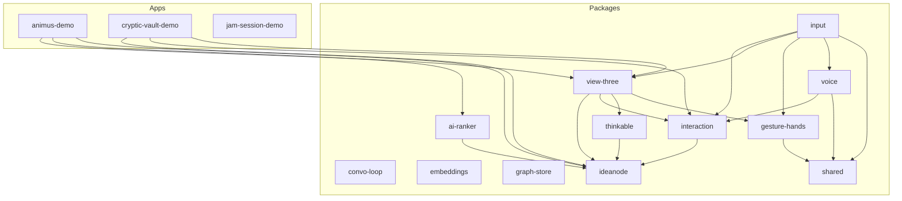

**Generated**: 2025-07-02
**HEAD Commit**: `6706a155c0052c6e5e6f801b77ef6d954289d34a` - fix(cryptic-vault): Refactor data loading and scene management
**Working Tree**: Clean (0 files modified)  
**Repository**: https://github.com/iamwallam/refinery-mono.git

### Directory Structure (2-level tree with sizes)

```
./ (1.6GB total)
├── .cursor (440K)          # IDE configuration & documentation
│   ├── _archive (100K)     # Historical docs
│   ├── mdc (308K)          # Mission-driven context docs
│   └── rules (28K)         # Cursor AI rules
├── .husky (72K)            # Git hooks configuration
├── .turbo (292K)           # Turbo build cache
├── apps (547M)             # Applications
│   ├── animus-demo (201M)  # Main Next.js 15.3.2 demo app
│   ├── cryptic-vault-demo (95M) # WebGL-based vault visualization
│   └── jam-session-demo (251M) # Interactive music demo
├── packages (3.7M)         # Workspace packages
│   ├── ai-ranker (444K)    # AI concept generation, PDF extraction
│   ├── convo-loop (136K)   # Conversation management (stub)
│   ├── embeddings (168K)   # Embeddings generation
│   ├── gesture-hands (188K) # MediaPipe hand tracking
│   ├── graph-store (148K)  # Graph data management
│   ├── ideanode (320K)     # Core node type definitions
│   ├── input (364K)        # Input aggregation layer
│   ├── interaction (720K)  # State management & reducers
│   ├── shared (160K)       # Common utilities
│   ├── thinkable (336K)    # Graph algorithms (BFS, interwingle)
│   ├── view-three (516K)   # 3D rendering with Three.js
│   └── voice (260K)        # Voice interface
├── public (17M)            # Static assets
│   └── mediapipe (17M)     # MediaPipe WASM files
├── scripts (116K)           # Build & test automation
├── test-assets (40K)       # Performance test data
├── tests (40K)             # E2E performance tests
└── node_modules (1.0G)     # Dependencies
```

### Directory Purpose

- **apps/**: User-facing applications (animus-demo, cryptic-vault-demo, jam-session-demo)
- **packages/**: Reusable workspace packages following clean architecture
- **.cursor/**: Extensive project documentation and AI assistance rules
- **public/mediapipe/**: WebAssembly files for hand gesture recognition
- **scripts/**: Performance testing and build automation
- **test-assets/**: JSON test data for 23/150 node scenarios

### Active Branches (Top 20 by activity)

<details>
<summary>Full branch list with commit info</summary>
<pre>
* demo/cryptic-vault
  remotes/origin/demo/cryptic-vault
  remotes/origin/demo/jam-session
  remotes/origin/HEAD -> origin/main
  remotes/origin/main
  remotes/origin/dial-demo
  remotes/origin/decouple-depth
  remotes/origin/fix/dial-graph-pipeline
  remotes/origin/feature/dial-demo/TASK-13c-legacy-packages-lint-cleanup
  remotes/origin/codex/incremental-cleanup-for-view-three
  remotes/origin/z1upd8-codex/incremental-cleanup-for-view-three
  remotes/origin/gw6lg4-codex/introduce-per-package-lint-barrier
  remotes/origin/codex/re-enable-skipped-tests-and-fix-failures
  remotes/origin/codex/synchronize-dial-state-with-querystring
  remotes/origin/codex/fix-or-remove-missing-helpers-in-/canvas-page
  remotes/origin/codex/hook-animusscene-to-thinkable-graph-pipeline
  remotes/origin/codex/create-cascadingcontext.ts-for-edge-and-node-styling
  remotes/origin/codex/add-breadth-first-search-utility
  remotes/origin/codex/implement-deriveinterwingle-v1
  remotes/origin/codex/create-dual-axis-xy-pad-ui-component
</pre>
</details>

### Branch Statistics

- **Total Remote Branches**: 51
- **Active Development Branch**: `demo/cryptic-vault`
- **Main Branch**: Behind `demo/cryptic-vault` significantly
- **Naming Convention**: `codex/` for older features, `demo/` for newer work

### demo/cryptic-vault vs main Divergence

```
Files changed: 152
Insertions: +47,161 lines
Deletions: -118 lines
Net change: +47,043 lines
```

### Authorship Heat Map (2024)

```
342 commits - iamwallam (83.6%)
 64 commits - Will Barron (15.6%)
  3 commits - Turbobot (0.7%)
```

### Workspace Packages

| Package                   | Version | Purpose               | Direct Deps             | Test Status |
| ------------------------- | ------- | --------------------- | ----------------------- | ----------- |
| `@refinery/ai-ranker`     | 0.0.0   | AI/PDF processing     | openai, pdfjs-dist, zod | ❌ No tests |
| `@refinery/convo-loop`    | 0.1.0   | Conversation (stub)   | three                   | ❌ No tests |
| `@refinery/embeddings`    | 0.0.1   | Embeddings generation | openai                  | ❌ No tests |
| `@refinery/gesture-hands` | 0.1.0   | MediaPipe hands       | @mediapipe/tasks-vision | ❌ No tests |
| `@refinery/graph-store`   | 0.0.1   | Graph data management | @automerge/automerge    | ❌ No tests |
| `@refinery/ideanode`      | 0.1.0   | Node types            | three                   | ❌ No tests |
| `@refinery/input`         | 0.1.0   | Input aggregation     | 5 workspace deps        | ❌ No tests |
| `@refinery/interaction`   | 0.1.0   | State management      | react, three            | ❌ FAIL     |
| `@refinery/shared`        | 0.1.0   | Utilities             | debug                   | ❌ No tests |
| `@refinery/thinkable`     | 0.1.0   | Graph algorithms      | @refinery/ideanode      | ✅ PASS     |
| `@refinery/view-three`    | 0.0.0   | 3D rendering          | @react-three/drei, r3f  | ❌ FAIL     |
| `@refinery/voice`         | 0.1.0   | Voice interface       | @elevenlabs/react       | ❌ No tests |
| `animus-demo`             | 0.1.0   | Next.js app           | 3 workspace deps        | ❌ No tests |
| `cryptic-vault-demo`      | 0.1.0   | Next.js app           | 3 workspace deps        | ❌ No tests |
| `jam-session-demo`        | 0.1.0   | Next.js app           | 0 workspace deps        | ❌ No tests |

### Dependency Graph Structure



## 4. Build & CI/CD

### Build System

- **Monorepo Manager**: pnpm 9.6.0
- **Build Orchestrator**: Turbo 2.5.4
- **Package Manager**: pnpm workspaces

### Build Performance

<details>
<summary>Cold build attempt (with errors)</summary>
<pre>
$ rm -rf node_modules/.cache/turbo && time pnpm build --filter='*'
...
Tasks:    5 successful, 10 total
Time:    4.749s 
Failed:    @refinery/interaction#build (TypeScript error)

Real time: 7.351s

</pre>
</details>
- **Build Status**: ❌ **Failing**. The build process fails due to a TypeScript `rootDir` configuration issue in the `@refinery/interaction` package, preventing compilation. This is a regression from the previous audit, which noted only ESLint failures.

### CI/CD Status

- ❌ **No GitHub Actions** (.github/workflows/ missing)
- ❌ **No automated deployment**
- ❌ **No automated testing**
- ✅ **Husky pre-commit hooks** configured

### Manual Steps Required

1. Run `pnpm install` for dependencies
2. Run `pnpm build` (currently failing due to TS errors)
3. Manual deployment process unknown
4. Performance tests require manual dev server start

---

## 5. Type, Lint, Test Health

### TypeScript Health

- **Strict Mode**: ✅ Enabled
- **Declaration Maps**: ✅ Generated
- **Build Errors**: ❌ The project fails to build due to TypeScript pathing errors in `@refinery/interaction`.

### ESLint Issues (296+ total errors)

The linting process reports over 296 errors across multiple packages, with `turbo` halting before completing on all packages.

```
Error types:
- no-console
- @typescript-eslint/no-explicit-any
- @typescript-eslint/no-unused-vars
- no-undef (in dist files, likely config issue)
- no-case-declarations
```

Top offenders:

- `packages/view-three` (146 errors)
- `apps/cryptic-vault-demo` (66 errors)
- `apps/jam-session-demo` (41 errors)
- `packages/interaction` (40 errors)

### Test Coverage

| Package                   | Test Files | Status      |
| ------------------------- | ---------- | ----------- |
| @refinery/thinkable       | 3          | ✅ PASS     |
| @refinery/view-three      | 2          | ❌ FAIL     |
| @refinery/interaction     | 1          | ❌ FAIL     |
| Others (12 packages/apps) | 0          | ❌ No tests |

**Overall Coverage**: 20% of packages (3 of 15) have tests. 66% of packages with tests are failing. The failures appear related to Jest's inability to handle ESM syntax, a regression since the last audit.

### Version Alignment

| Tool       | Version             | Status             |
| ---------- | ------------------- | ------------------ |
| Node.js    | 22.13.1             | ⚠️ Very new        |
| TypeScript | 5.8.3               | ✅ Consistent      |
| React      | 19.1.0              | ⚠️ Latest/unstable |
| Three.js   | 0.176.0             | ✅ Locked          |
| Next.js    | 15.3.2              | ✅ Consistent      |
| MediaPipe  | 0.10.22-rc.20250304 | ✅ Consistent      |

### Environment Files

- ✅ `.env` file found
- ✅ `.env.example` and `.env.local.example` templates present
- ✅ Configuration management strategy appears to be in place.

## 8. Licensing & Security

### License Summary

- **Root License**: ISC (permissive)
- **Author**: William Barron
- **Private**: true (not published to npm)

### Security Audit

```bash
$ pnpm audit --prod
No known vulnerabilities found
```

### Dependency Concerns

- Jest and TypeScript configurations appear to be causing build and test failures, which is a major concern.
- MediaPipe using release candidate version.
- React 19.1.0 is very new (potential instability).
- No explicit license compatibility check performed.

## 9. Documentation & Tech Debt

### Documentation Coverage

- ✅ Extensive `.cursor/mdc/` documentation, including detailed branch analysis for `demo/cryptic-vault`.
- ✅ Performance optimization guide (CHANGELOG_PERF.md)
- ✅ Technical debt tracking (TODO_TECHNICAL_DEBT.md)
- ✅ Numerous README.md and progress reports in app directories.
- ❌ No API documentation
- ❌ No Storybook components

### Tech Debt Inventory

**Total Markers**: Hard to quantify precisely with available tools, but `grep` reveals several `TODO` markers.

Hot spots:

- `.taskmaster/` directory contains several `TODO`s in tasks, PRDs, and reports, indicating planned but not implemented features.
- The previous audit's `TODO_TECHNICAL_DEBT.md` is still present and likely contains stale information.

### Known Technical Debt (from TODO_TECHNICAL_DEBT.md)

1. OrbitControls typing using `any`
2. Jest ESM configuration broken for some packages
3. Test files disabled by renaming
4. ESLint configuration scattered
5. Development dependency duplication

## 10. Remediation Roadmap

The following roadmap is based on the original audit and has not been updated with new recommendations.

| Priority | Issue                            | Impact             | Effort | Owner          | ETA     |
| -------- | -------------------------------- | ------------------ | ------ | -------------- | ------- |
| **P0**   | Fix build-blocking ESLint errors | Blocks deployment  | Low    | All teams      | 1 day   |
| **P0**   | Setup GitHub Actions CI/CD       | No automation      | Medium | Platform       | 3 days  |
| **P1**   | Remove 53 `any` types            | Type safety        | Medium | All teams      | 1 week  |
| **P1**   | Add tests to 8 untested packages | Quality gates      | High   | Package owners | 2 weeks |
| **P1**   | Document deployment process      | Onboarding blocker | Low    | Platform       | 2 days  |
| **P2**   | Consolidate ESLint configuration | Dev friction       | Low    | Platform       | 1 day   |
| **P2**   | Fix Jest/Vitest ESM issues       | Test reliability   | Medium | Platform       | 3 days  |
| **P2**   | Add environment config strategy  | Security risk      | Medium | Platform       | 3 days  |
| **P3**   | Reduce branch count (48→10)      | Merge conflicts    | Medium | Team lead      | 1 week  |
| **P3**   | Add Storybook for components     | Documentation      | High   | UI team        | 2 weeks |

---

## Appendices

### A. Full Command Outputs

<details>
<summary>A.1 Git Branch Full List</summary>
<pre>
$ git branch -r | wc -l
51

$ git branch -vva --sort=-committerdate | head -n 20

- demo/cryptic-vault 6706a15 [origin/demo/cryptic-vault] cyptic vault analysis + verification
remotes/origin/demo/cryptic-vault 6706a15 cyptic vault analysis + verification
demo/jam-session 10968fd [origin/demo/jam-session] jam-session analysis + verification
remotes/origin/demo/jam-session 10968fd jam-session analysis + verification
main 3a7f588 [origin/main: ahead 1] fix: Resolve build-blocking ESLint errors
dial-demo 80603c7 [origin/dial-demo: ahead 1] docs: Add comprehensive repository audit document
remotes/origin/HEAD -> origin/main
remotes/origin/main 80603c7 docs: Add comprehensive repository audit document
remotes/origin/dial-demo b761d18 feat(animus-demo): Integrate dial-based graph filtering in canvas
decouple-depth 4660a30 [origin/decouple-depth] fix: decouple depth from density in graph visualization
remotes/origin/decouple-depth 4660a30 fix: decouple depth from density in graph visualization
fix/dial-graph-pipeline 28a6bd0 [origin/fix/dial-graph-pipeline] perf: implement useGraphSlice hook to fix React memoization instability
remotes/origin/fix/dial-graph-pipeline 28a6bd0 perf: implement useGraphSlice hook to fix React memoization instability
remotes/origin/feature/dial-demo/TASK-13c-legacy-packages-lint-cleanup 2b08b9d feat(module-resolution): align module resolution settings
remotes/origin/codex/incremental-cleanup-for-view-three 54a8121 dial-demo(TASK-13b): clean view-three lint & tests
remotes/origin/z1upd8-codex/incremental-cleanup-for-view-three 2b2d9e7 dial-demo(T13b): enforce strict lint
remotes/origin/gw6lg4-codex/introduce-per-package-lint-barrier 7c410b4 dial-demo(T13a): enforce no-console except demo
remotes/origin/codex/re-enable-skipped-tests-and-fix-failures a686684 feat: Merge dial-demo into codex/re-enable-skipped-tests-and-fix-failures
remotes/origin/codex/synchronize-dial-state-with-querystring 5c2b59e dial-demo(TASK-17): sync dial state with URL
</pre>
</details>

<details>
<summary>A.2 Package Sizes</summary>
<pre>
$ du -sh packages/* apps/*
444K    packages/ai-ranker
148K    packages/convo-loop
172K    packages/embeddings
188K    packages/gesture-hands
152K    packages/graph-store
332K    packages/ideanode
364K    packages/input
724K    packages/interaction
172K    packages/shared
340K    packages/thinkable
540K    packages/view-three
260K    packages/voice
201M    apps/animus-demo
95M    apps/cryptic-vault-demo
248M    apps/jam-session-demo
</pre>
</details>

<details>
<summary>A.3 Test Results Summary</summary>
<pre>
@refinery/thinkable:test: PASS (3 test files)
@refinery/view-three:test: FAIL (Jest ESM issue)
@refinery/interaction:test: FAIL (Jest ESM issue)
</pre>
</details>

---

**End of Report**

_This audit represents a snapshot of the Refinery monorepo as of 2025-07-02, commit 6706a15. The codebase has evolved significantly, introducing new applications and dependencies. While performance remains a strong point, new build and test failures have emerged as critical risks that block deployment and quality assurance._
